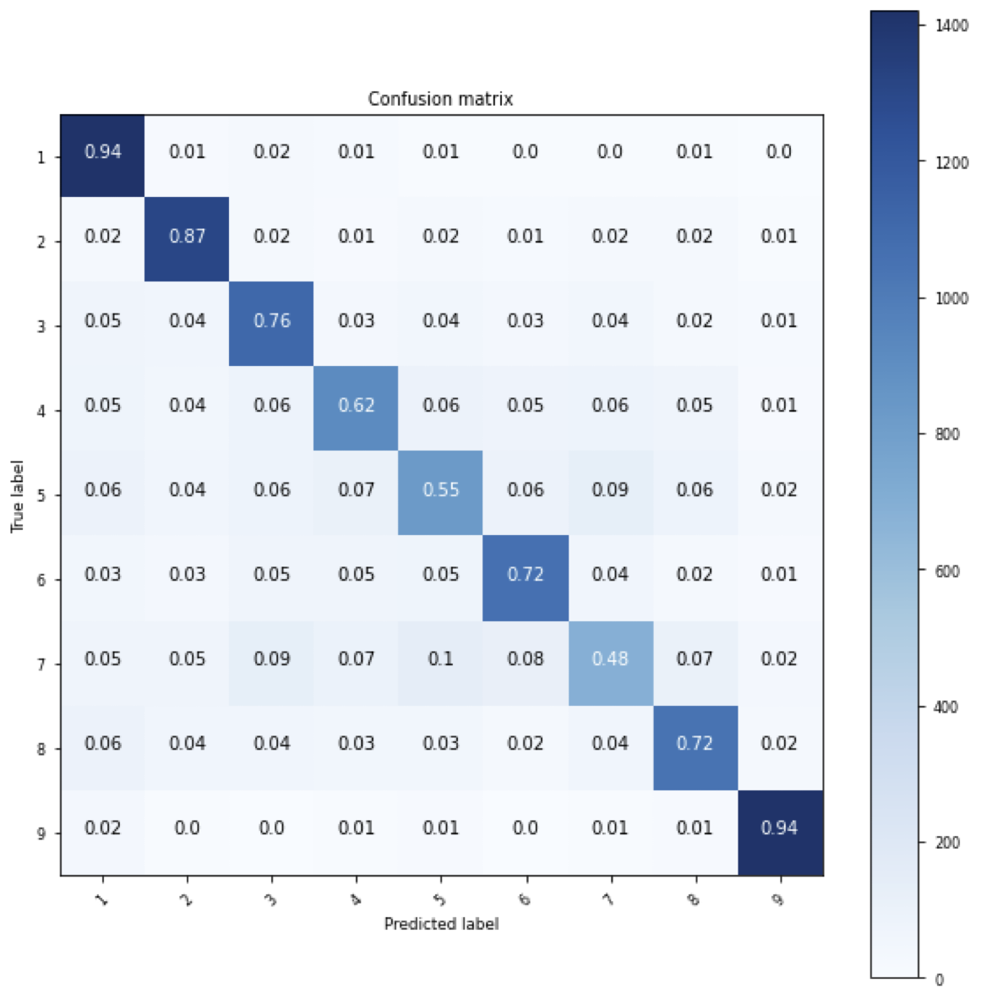
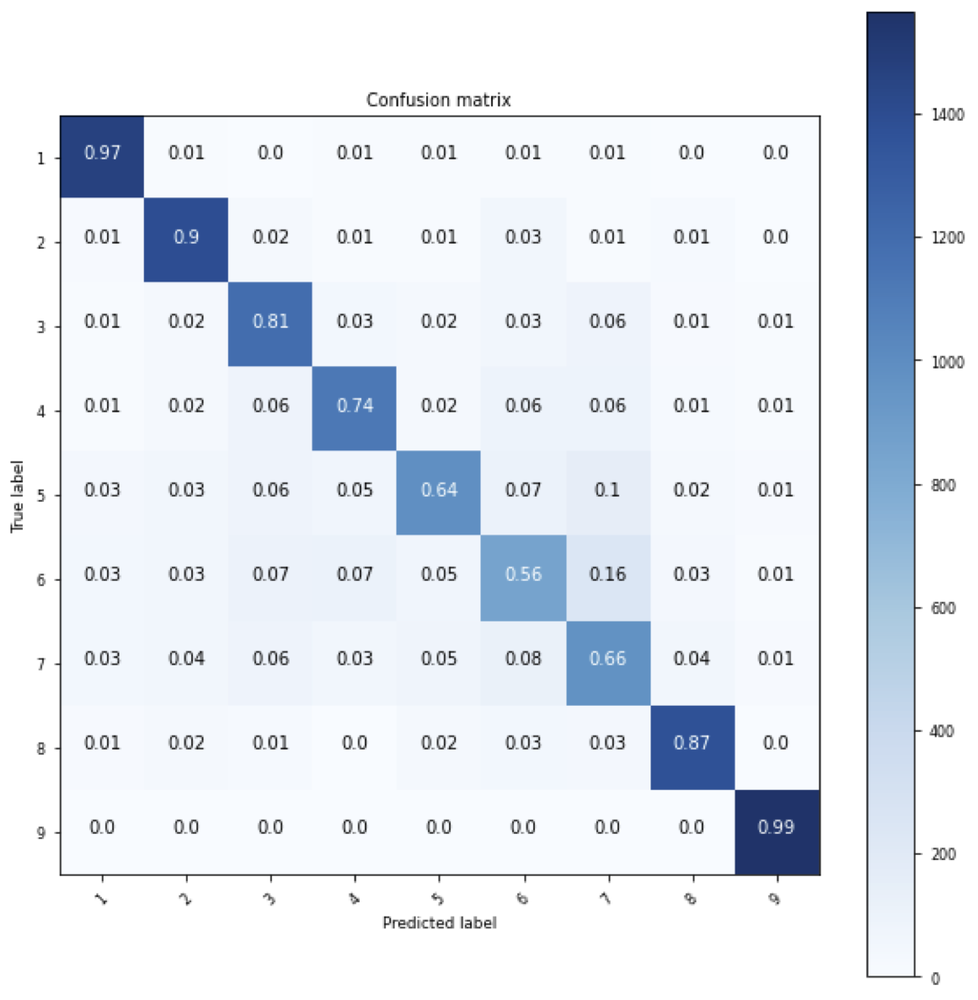

# DEAP Dataset Emotion Recognition with MLSTM-FCN

This project uses the [DEAP dataset](https://www.eecs.qmul.ac.uk/mmv/datasets/deap/) to train a model that predicts emotion-related features (valence, arousal) based on GSR (Galvanic Skin Response), Respiration, PPG (Photoplethysmography), and Temperature signals. The dataset includes ratings from 32 subjects on 40 one-minute-long video clips.

## Dataset Overview
- **Subjects**: 32
- **Videos**: 40 (60 seconds each)
- **Ratings**: Valence, arousal, dominance, and liking (on a 9-point continuous scale)

### Data Segmentation
The data was segmented as follows:
- **Total Data**: \(32 \, \text{subjects} \times 40 \, \text{videos} \times (60 + 3) \, \text{seconds}\)
- **After Segmentation**: 25,600 data points were extracted.
- **Overlap**: 2-second overlap with a 5-second window, sampled at 128 Hz.

## Preprocessing
The `preprocess_data` function is responsible for preprocessing the signals from the DEAP dataset. It performs the following tasks:
- Preprocesses the physiological signals (GSR, Respiration, PPG, and Temperature) for each subject.
- Segments the signals into overlapping windows (5-second windows with a 2-second overlap) to prepare the data for model input.
- Normalizes the segmented data using a `MinMaxScaler` to ensure all features are on the same scale.
- Handles class imbalance by applying oversampling techniques (e.g., randomly duplicating underrepresented classes) to balance the dataset.
- Extracts corresponding labels for valence, arousal, and other emotional states for use in classification tasks.

## Model: MLSTM-FCN
The MLSTM-FCN model was trained on this dataset with the following architecture and training parameters:

### Convolutional Layers
- **Number of Filters**: 128, 256, 128
- **Kernel Size**: 8, 5, 3
- **Activation Function**: ReLU

### LSTM Configuration
- **Number of LSTM Cells**: 8, 64, 128 (depending on the experiment)

### Training Setup
- **Train-Test Split**: 70% train, 30% test
- **Batch Size**: 128
- **Epochs**: 2000
- **Optimizer**: Adam
- **Learning Rate**: \(1 \times 10^{-4}\), reduced by a factor of \(1/\sqrt[3]{2}\) every 100 epochs

## Initial Results
### Arousal
| Batch Size | # LSTM Cells | Accuracy |
|------------|--------------|----------|
| 64         | 8            | 47.3%    |
| 128        | 8            | 43.8%    |
| 128        | 64           | 41.7%    |
| 128        | 128          | 36.1%    |

### Valence
| Batch Size | # LSTM Cells | Accuracy |
|------------|--------------|----------|
| 64         | 8            | 37.9%    |
| 128        | 8            | 47.7%    |
| 128        | 64           | 39.9%    |
| 128        | 128          | 33.5%    |

## Improved Results with Oversampling
To address class imbalance, I applied oversampling by duplicating samples from smaller classes. This led to improved results.

### Arousal
- **Number of Classes**: 9
- **Number of Samples**: 45,720
- **Batch Size**: 64
- **Number of LSTM Cells**: 8
- **Epochs**: 2000
- **Accuracy**: 75.36%

### Valence
- **Number of Classes**: 9
- **Number of Samples**: 44,460
- **Batch Size**: 128
- **Number of LSTM Cells**: 8
- **Epochs**: 2000
- **Accuracy**: 77.81%

### Confusion Matrix
Below are confusion matrices for Arousal and Valence classifications:




## TensorBoard Visualization
To visualize the training logs, including loss, accuracy, and confusion matrices, you can use TensorBoard.

Run the following command to launch TensorBoard:
```bash
tensorboard --logdir ./log/DEAP_V_c8_b128_OverSample_e2000_log
```
Different log files for various experiments can be found in the `log/` folder.

## Conclusion
This project demonstrates the potential of using MLSTM-FCN with oversampling techniques to improve emotion classification accuracy based on GSR, Respiration, PPG, and Temperature signals. The oversampling approach resulted in significant performance improvements for both arousal and valence predictions.

## Acknowledgments
The MLSTM-FCN code used in this project is based on an existing implementation, which has been reused with modifications to fit the needs of this project. Significant changes were made to adapt the code for the DEAP dataset and improve model performance.

Original code can be found [here](https://github.com/titu1994/MLSTM-FCN?tab=readme-ov-file).

### Modifications:
- Adapted the input for DEAP dataset signal processing (GSR, Respiration, PPG, and Temperature signals).
- Added oversampling techniques to handle class imbalance.
- Adjusted model architecture parameters such as the number of LSTM cells, learning rate schedule, and batch size.
- Integrated TensorBoard for logging training metrics, including loss, accuracy, and confusion matrices for detailed visualization.

Thank you to the original authors for their work on the MLSTM-FCN model, and for the foundational code that allowed these enhancements.
